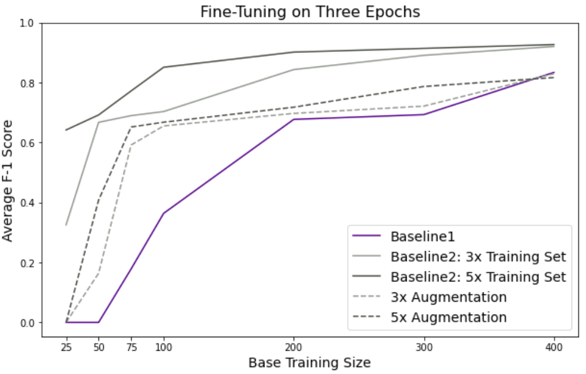

# MLLU-Paper

*Repo for SROIE/MLLU paper implementation*

Our basline results of fine-tuning LayoutLM with the vanilla data given in SROIE demonstrated an average F-1 score of 0.9014.
The F-1 scores per-label prediction are as follows:

- Other: 0.98839144
- Date: 0.95430393
- Total: 0.63914373
- Company:  0.95783612
- Address: 0.96761965

